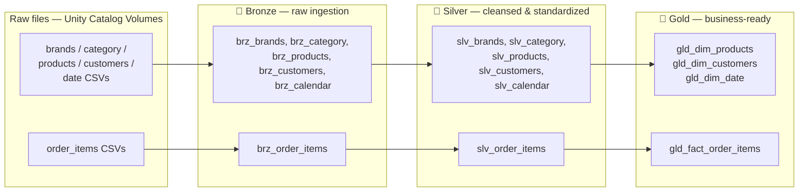
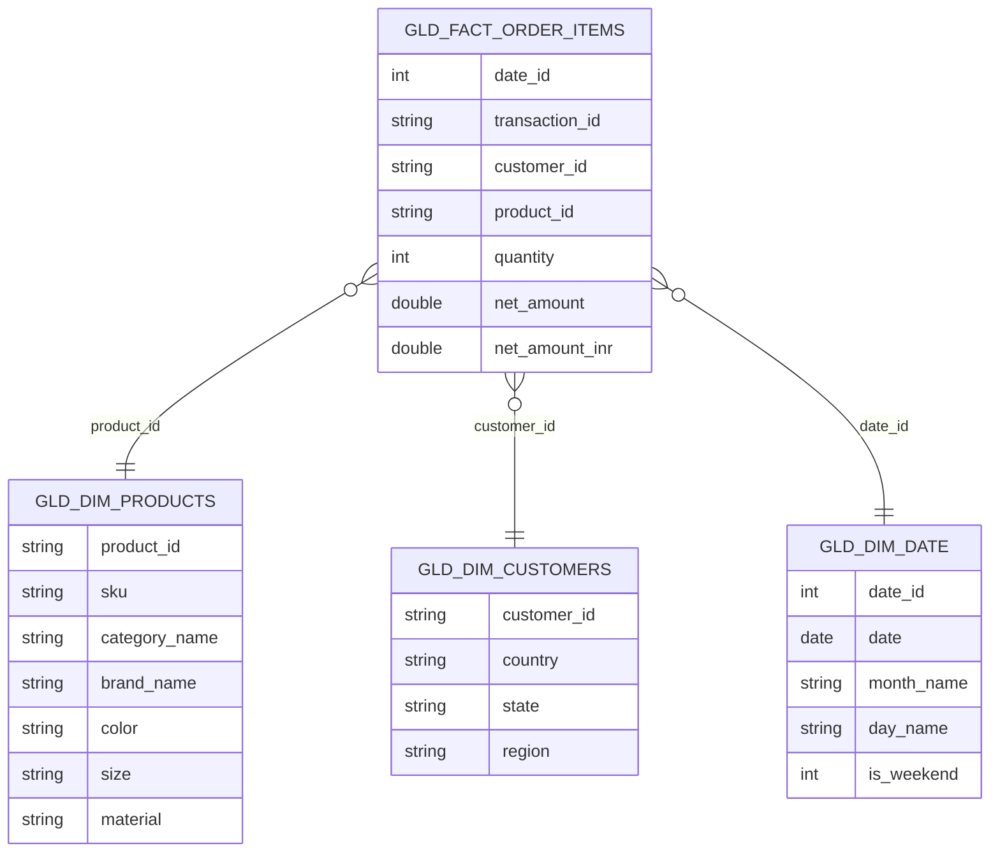

# Project Ecommerce


-blue)

A Databricks lakehouse pipeline that ingests raw e-commerce data (customers, products, brands, categories, calendar, and order line items) and processes it through a **Bronze → Silver → Gold medallion architecture**, using PySpark, Spark SQL, and Delta Lake on Unity Catalog, to produce clean, analytics-ready dimension and fact tables for e-commerce sales reporting.

## Architecture



Every layer is written as a Delta table (`.mode("overwrite")`, `mergeSchema=true`) inside a single Unity Catalog catalog named **`ecommerce`**, split across three schemas: `bronze`, `silver`, `gold`.

## Repository structure

```
project_commerce/
├── setup/
│   └── setup.ipynb              # Creates the ecommerce catalog and bronze/silver/gold schemas
├── medallion_processing_dim/
│   ├── dim_bronze.ipynb         # Raw ingestion: brands, category, products, customers, calendar
│   ├── dim_silver.ipynb         # Cleansing & standardization of the dimension data above
│   └── dim_gold.ipynb           # Builds gld_dim_products, gld_dim_customers, gld_dim_date
└── medallion_processing_fact/
    ├── fact_bronze.ipynb        # Raw ingestion: order_items
    ├── fact_silver.ipynb        # Cleansing of order_items (types, symbols, channel names)
    └── fact_gold.ipynb          # Metrics + FX conversion → gld_fact_order_items
```

## Data model (star schema)



## Layer-by-layer breakdown

### Bronze — raw ingestion
Reads CSVs from Unity Catalog Volumes with an explicit schema, tags every row with its source file path and an ingestion timestamp, then overwrites the target Delta table:

| Table | Source path |
|---|---|
| `bronze.brz_brands` | `/Volumes/ecommerce/source_data/raw/brands/*.csv` |
| `bronze.brz_category` | `/Volumes/ecommerce/source_data/raw/category/*.csv` |
| `bronze.brz_products` | `/Volumes/ecommerce/source_data/raw/products/*.csv` |
| `bronze.brz_customers` | `/Volumes/ecommerce/source_data/raw/customers/*.csv` |
| `bronze.brz_calendar` | `/Volumes/ecommerce/source_data/raw/date/*.csv` |
| `bronze.brz_order_items` | `/Volumes/ecommerce/source_data/raw/order_items/landing/*.csv` |

### Silver — cleansing & standardization
| Table | Key transformations |
|---|---|
| `slv_brands` | Trims `brand_name`; strips non-alphanumeric characters from `brand_code`; corrects known `category_code` anomalies (e.g. `GROCERY` → `GRCY`) |
| `slv_category` | Drops duplicate `category_code` rows; uppercases `category_code` |
| `slv_products` | Casts `weight_grams` (strips `"g"`) and `length_cm` (comma → dot) to numeric types; uppercases `category_code`/`brand_code`; fixes material typos (`Coton`→`Cotton`, `Alumium`→`Aluminum`, `Ruber`→`Rubber`); takes `abs()` of `rating_count` and defaults nulls to `0` |
| `slv_customers` | Drops rows with a null `customer_id`; fills missing `phone` with `"Not Available"` |
| `slv_calendar` | Parses `date` string to a real date; deduplicates on `date`; title-cases `day_name`; reformats `quarter` (`Qn-yyyy`) and `week_of_year` → `week` (`Week-n-yyyy`) |
| `slv_order_items` | Deduplicates on `(order_id, item_seq)`; fixes text quantities (`"Two"` → `2`); strips `$`/`%` from price and discount fields; normalizes `channel` (`web`→`Website`, `app`→`Mobile`); parses `dt` and multiple `order_ts` timestamp formats; adds `processed_time` |

### Gold — business-ready tables
| Table | Logic |
|---|---|
| `gld_dim_products` | Joins products with brand and category names, defaulting to `"Not Available"` when a lookup misses |
| `gld_dim_customers` | Maps each customer's `country`/`state` to a `region` via a hand-built lookup covering India, the US, UK, Australia, Canada, the UAE, and Singapore (unmatched → `"Other"`) |
| `gld_dim_date` | Adds an integer `date_id` (`yyyyMMdd`), `month_name`, and an `is_weekend` flag |
| `gld_fact_order_items` | Computes `gross_amount`, `discount_amount`, and `net_amount`; derives `date_id` and a `coupon_flag`; converts `net_amount` to INR using a static FX rate table (INR, AED, AUD, CAD, GBP, SGD, USD) |

## Tech stack
- **Databricks** — notebooks, Unity Catalog, Volumes
- **Apache Spark / PySpark** — DataFrame transformations
- **Spark SQL** — gold-layer joins and DDL
- **Delta Lake** — table storage format for all three layers

## Prerequisites
- A Databricks workspace with Unity Catalog enabled and permissions to create catalogs/schemas
- Raw CSV files uploaded to a Unity Catalog Volume, matching the paths listed under [Bronze](#bronze--raw-ingestion) (a volume named `ecommerce.source_data.raw` with the subfolders shown above)

## Getting started
1. Import this repository's notebooks into your Databricks workspace.
2. Run `setup/setup.ipynb` to create the `ecommerce` catalog and its `bronze`/`silver`/`gold` schemas.
3. Land the raw CSVs in the Volume paths listed above.
4. Run the dimension pipeline in order: `dim_bronze.ipynb` → `dim_silver.ipynb` → `dim_gold.ipynb`.
5. Run the fact pipeline in order: `fact_bronze.ipynb` → `fact_silver.ipynb` → `fact_gold.ipynb`.
6. Query the resulting star schema under `ecommerce.gold.*`.

## Possible next steps
- Orchestrate the six notebooks as a Databricks Workflow/Job with task dependencies instead of manual, sequential runs.
- Move the hardcoded FX rate table and region-mapping dictionaries into a config table or reference file.
- Add data-quality checks (e.g. row-count/expectation tests) between layers.

## License
No license file is currently included in this repository.
